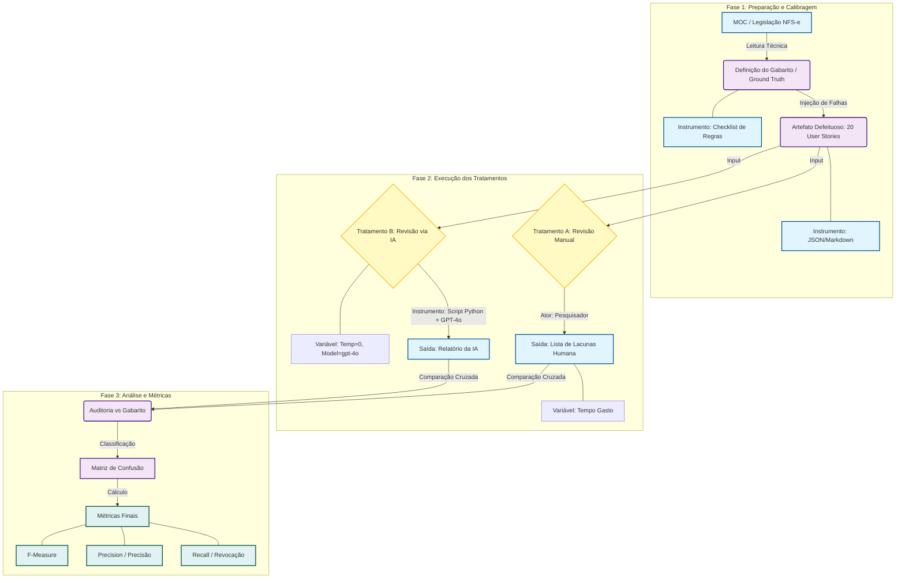

# Trabalho-Final-Proposta-de-Experimento-para-TCC

# Plano de Experimento – Scoping e Planejamento

## 1. Identificação básica

### 1.1 Título do experimento

Detecção de Lacunas na Elicitação de Requisitos: Uma abordagem comparativa assistida por Inteligência Artificial Generativa.

### 1.2 ID / código

PRE-TCC-001

### 1.3 Versão do documento e histórico de revisão

* **Versão Atual:** v1.3 (Planejamento Operacional e Administrativo)
* **Histórico:**
  * **v1.0 (21/11/2025):** Criação inicial da proposta de Scoping.
  * **v1.1 (26/11/2025):** Inclusão da matriz GQM, definição detalhada de métricas, refinamento do contexto fiscal e análise de riscos.
  * **v1.2 (28/11/2025):** Detalhamento de população, amostragem, instrumentação, protocolo experimental e plano de análise de dados.
  * **v1.3 (02/12/2025):** Definição das seções administrativas: Ética, Recursos, Cronograma, Governança, Documentação, Comunicação e Critérios de Prontidão.

### 1.4 Datas (criação, última atualização)

* **Data de criação:** 21/11/2025
* **Última atualização:** 02/12/2025

### 1.5 Autores (nome, área, contato)

Wilken Henrique Moreira
    - Instituição: PUC Minas
    - Curso: Engenharia de Software (4º Período)
    - Contato: wilkenhenriquemoreira@gmail.com

### 1.6 Responsável principal (PI / dono do experimento)

Wilken Henrique Moreira (Pesquisador Principal)

### 1.7 Projeto / produto / iniciativa relacionada

- Contexto Acadêmico: Trabalho de Conclusão de Curso (Pré-TCC) em Engenharia de Software - PUC Minas.
- Área de Conhecimento: Engenharia de Requisitos e Inteligência Artificial Aplicada.
- Natureza do Trabalho: Pesquisa Experimental e Prototipação de Ferramenta de Apoio à Decisão.

## 2. Contexto e problema

### 2.1 Descrição do problema / oportunidade

Como evidenciado por Wiegers e Beatty (2013), requisitos frequentemente permanecem não declarados devido à suposição de 'conhecimento comum' (tacit knowledge). Analistas podem falhar em explicitar fluxos de exceção e requisitos não-funcionais por assumirem que estes são óbvios ou por falta de questionamento direcionado durante a elicitação.

Desse modo, fatores humanos como a inexperiência, fadiga cognitiva ou falhas de atenção resultam em lacunas críticas nos documentos de especificação. Consequentemente, tais omissões só são identificadas tardiamente, nas etapas de desenvolvimento ou produção, gerando um aumento exponencial nos custos de correção, conforme alerta Boehm (1981).

### 2.2 Contexto organizacional e técnico

O experimento será conduzido em um ambiente acadêmico controlado, simulando o desenvolvimento de um módulo de Documentos Fiscais Eletrônicos (DF-e) integrado a um sistema de gestão (ERP). O cenário foi delimitado estrategicamente considerando o atual momento de transição tributária no Brasil, marcado pela implementação do Padrão Nacional de NFS-e, que visa unificar os layouts municipais.

A escolha do domínio de Nota Fiscal de Serviço Eletrônica (NFS-e) serve estritamente como um cenário de validação para a ferramenta de IA. Este contexto foi selecionado por oferecer um terreno ideal para mensurar resultados: a existência de um "gabarito" claro e incontestável. Enquanto a maioria dos sistemas possui requisitos subjetivos, o ambiente fiscal impõe regras binárias — ou o requisito atende à legislação e aos Manuais de Orientação (MOC), ou não atende. Essa característica permite verificar com exatidão matemática os acertos e erros da Inteligência Artificial, eliminando a ambiguidade na hora de avaliar a eficácia da ferramenta.

No que tange aos atores envolvidos, o pesquisador assumirá o papel de um Analista de Requisitos em formação, responsável por especificar fluxos básicos de faturamento ("Caminho Feliz"), deliberadamente suscetíveis ao desconhecimento das minúcias do novo padrão nacional. Em contrapartida, o Agente Inteligente atuará como um "Auditor Fiscal Digital", confrontando os requisitos humanos contra a base legal para identificar falhas de conformidade, ausência de tratamento de contingência (como a indisponibilidade da API da Receita) e erros de validação de esquema.

Para operacionalizar o experimento, será utilizado um arcabouço tecnológico baseado na linguagem Python 3.x para a orquestração e análise comparativa, consumindo o modelo OpenAI GPT-4o via API. Todo o processo seguirá uma abordagem de Engenharia de Requisitos Ágil, utilizando Histórias de Usuário  e Critérios de Aceite, refletindo a realidade das *Software Houses* modernas que necessitam de agilidade sem abrir mão da rigorosa conformidade legal exigida pela Lei da Liberdade Econômica.

### 2.3 Trabalhos e evidências prévias (internos e externos)

Esta proposta situa-se na interseção entre a prática empírica de desenvolvimento de software e o estado da arte da pesquisa em Inteligência Artificial Aplicada.

No contexto interno, observações realizadas durante a análise técnica da API nacional da SEFAZ evidenciaram um padrão crítico, alinhado ao que **Curtis, Krasner e Iscoe (1988)** descrevem como a "escassez de conhecimento de domínio". A validação manual tende a priorizar o "Caminho Feliz", negligenciando regras fiscais restritivas. Isso ocorre porque a tradução do *Manual de Orientação do Contribuinte (MOC)* para requisitos técnicos impõe uma barreira cognitiva significativa, onde a distância entre a linguagem jurídica e a implementação técnica gera lacunas de especificação.

No cenário externo, a literatura sobre *AI4RE (Artificial Intelligence for Requirements Engineering)* apresenta crescimento exponencial. Estudos recentes, como a revisão sistemática de **Zhao et al. (2023)**, demonstram a eficácia de Grandes Modelos de Linguagem (LLMs) na elicitação de requisitos. Contudo, conforme apontado por **Arora et al. (2023)**, a maioria das pesquisas concentra-se na capacidade generativa (criar artefatos) e menos na capacidade analítica de garantia de qualidade em domínios críticos.

Existe, portanto, uma lacuna científica quanto ao uso de LLMs para **Auditoria de Conformidade** em cenários regulados. Diferente da extração de requisitos gerais discutida por **Breaux (2009)**, este trabalho foca na precisão da IA moderna em validar a aderência normativa no cenário fiscal brasileiro, onde a tolerância a alucinações é nula.

### 2.4 Referencial teórico e empírico essencial

A fundamentação científica deste experimento conecta três áreas essenciais: a normalização da qualidade de software, a tecnologia de modelos de linguagem e a objetividade das regras fiscais.

No que tange à Engenharia de Requisitos, o estudo apoia-se nas definições da norma **ISO/IEC 29148**. O conceito central adotado aqui é o de **Completude**: em sistemas críticos, um requisito só é considerado completo se prevê não apenas o funcionamento básico, mas também todas as exceções e restrições. Esse olhar é complementado pela norma **ISO/IEC 25010**, que trata da qualidade do produto. Neste trabalho, entende-se que, para software fiscal, a **Conformidade Funcional** não é um atributo secundário, mas o núcleo da qualidade do sistema. Teoricamente, isso significa que deixar de especificar um tratamento de erro previsto no Manual da Receita não é apenas um esquecimento, é uma falha crítica de conformidade.

Para atuar sobre esse problema, a pesquisa explora os **Grandes Modelos de Linguagem (LLMs)** baseados na arquitetura *Transformer*. O diferencial teórico explorado não é o retreinamento da IA, mas sim sua capacidade de **Aprendizado em Contexto** (*In-Context Learning*). O experimento utiliza técnicas como a **Cadeia de Pensamento** (*Chain-of-Thought*), descrita por Wei et al. (2022), que induz o modelo a "raciocinar" passo a passo. Estudos empíricos indicam que essa abordagem melhora significativamente a capacidade da IA de validar regras lógicas e reduz as "alucinações" (respostas inventadas), tornando-a viável para tarefas de auditoria.

Por fim, a validação de todo esse processo exige um cenário de teste com regras indiscutíveis. É aqui que entra o conceito de **Oráculo de Teste**, oriundo da teoria de Teste de Software. O domínio de Documentos Fiscais Eletrônicos (DF-e) fornece exatamente isso: um "Oráculo Normativo". Diferentemente de áreas subjetivas, como a experiência do usuário, as regras de validação da SEFAZ funcionam como uma verdade fundamental (*Ground Truth*). Isso permite medir matematicamente a eficácia da IA, pois cada lacuna que ela apontar poderá ser verificada binariamente: ou a regra existe na legislação vigente, ou a IA cometeu um erro.

## 3. Objetivos e questões (Goal / Question / Metric)

### 3.1 Objetivo geral (Goal template)

Analisar o uso de Grandes Modelos de Linguagem (LLMs), especificamente a arquitetura GPT-4o, com o propósito de avaliar a eficácia técnica da ferramenta no apoio à auditoria de requisitos, com respeito à capacidade de detecção de lacunas de conformidade (compliance) e completude normativa, sob a perspectiva do Analista de Requisitos e da Engenharia de Software, no contexto da especificação de um módulo de emissão de Nota Fiscal de Serviço Eletrônica (NFS-e), caracterizado por regras de negócio rígidas e objetivas.

| **No Escopo (In Scope)** | **Fora do Escopo (Out of Scope)** |
| :--- | :--- |
| **Processo:** Validação e verificação de requisitos funcionais e não-funcionais de *compliance* fiscal (NFS-e). | **Processo:** Desenvolvimento de código-fonte, implementação de banco de dados, interfaces de usuário (telas) ou testes unitários. |
| **Ferramenta:** Utilização de LLMs (GPT-4o) via API e técnicas de Engenharia de Prompt (*Few-Shot*, *Chain-of-Thought*). | **Ferramenta:** Treinamento (*Fine-tuning*) de novos modelos de IA ou criação de arquiteturas de redes neurais do zero. |
| **Domínio:** Regras de emissão de Nota Fiscal de Serviço (NFS-e) e integração com o Padrão Nacional. | **Domínio:** Regras de NF-e (Mercadorias), CT-e (Transporte), SPED Contábil ou cálculos tributários complexos de ICMS. |
| **Artefato:** Histórias de Usuário (*User Stories*), Critérios de Aceite e Regras de Negócio textuais. | **Artefato:** Diagramas UML complexos, Prototipação de telas (*Wireframes*), Testes de Carga ou Documentação de Arquitetura. |

### 3.2 Objetivos específicos

Para concretizar o objetivo geral, o experimento define as seguintes metas de análise:

* **O1:** **Validar a eficácia** do modelo GPT-4o na detecção de lacunas de requisitos e regras de negócio omitidas, verificando se a ferramenta consegue identificar falhas críticas de conformidade.
* **O2:** **Medir a confiabilidade** das sugestões geradas pela IA, quantificando a taxa de "alucinações" (falsos positivos) para determinar se a ferramenta é segura para uso profissional.
* **O3:** **Analisar o impacto** das técnicas de Engenharia de Prompt (*Chain-of-Thought*) na qualidade das respostas, verificando se o uso de instruções estruturadas melhora o raciocínio lógico da IA sobre a legislação.
* **O4:** **Comparar o desempenho** da revisão assistida por IA frente à revisão manual tradicional, avaliando potenciais ganhos de cobertura na inspeção de requisitos.

### 3.3 Questões de pesquisa / de negócio

| Questão de Pesquisa (Question) | Métricas Associadas (Metric) |
| :--- | :--- |
| **Q1.1:** Qual a volumetria de regras mandatórias extraídas dos manuais oficiais? | M1 (Total de Regras Mapeadas) M2 (Densidade Regulatória) |
| **Q1.2:** Qual a complexidade ciclomática média das regras de negócio mapeadas? | M3 (Complexidade da Regra) M4 (Nível de Dependência) |
| **Q1.3:** Quais categorias de requisitos (Segurança, Fiscal, Dados) são mais prevalentes? | M5 (Distribuição por Categoria) M1 (Total de Regras Mapeadas) |
| **Q2.1:** Qual a taxa de omissão intencional inserida no artefato de controle? | M6 (Taxa de Defeito Injetado) M7 (Severidade da Omissão) |
| **Q2.2:** O artefato reflete a realidade de uma especificação júnior típica? | M8 (Índice de Similaridade Júnior) M9 (Legibilidade do Requisito) |
| **Q2.3:** As falhas inseridas cobrem todas as categorias críticas mapeadas no O1? | M10 (Cobertura de Falhas por Categoria) M5 (Distribuição por Categoria) |
| **Q3.1:** Qual técnica de prompt gera respostas mais estruturadas (JSON vs Texto)? | M11 (Taxa de Conformidade de Saída) M12 (Tempo de Inferência) |
| **Q3.2:** A IA consegue manter o contexto das regras fiscais em conversas longas? | M13 (Janela de Contexto Efetiva) M14 (Estabilidade da Resposta) |
| **Q3.3:** O custo computacional (tokens) viabiliza o uso da ferramenta em escala? | M15 (Custo por Requisito Analisado) M16 (Consumo de Tokens) |
| **Q4.1:** Qual a eficácia da IA em encontrar as lacunas injetadas (Recall)? | M17 (Recall / Revocação) M18 (Falsos Negativos) |
| **Q4.2:** Qual a confiabilidade das sugestões da IA (evitando alucinações)? | M19 (Precision / Precisão) M20 (Taxa de Alucinação) |
| **Q4.3:** Qual o ganho de eficiência comparado a uma revisão manual estimada? | M21 (Tempo Economizado Estimado) M22 (F-Measure) |

### 3.4 Métricas associadas (GQM)

Abaixo, detalham-se todas as métricas citadas no GQM, com suas descrições operacionais e unidades de medida.

| ID | Nome da Métrica | Descrição Operacional | Unidade |
| :--- | :--- | :--- | :--- |
| **M1** | Total de Regras Mapeadas | Contagem absoluta de regras extraídas do Manual (MOC) para o gabarito. | Inteiro (Qtd) |
| **M2** | Densidade Regulatória | Razão entre número de regras e número de campos do layout da nota. | Regras/Campo |
| **M3** | Complexidade da Regra | Classificação da regra: 1 (Simples/Formato), 2 (Lógica), 3 (Dependência Externa). | Escala Ordinal (1-3) |
| **M4** | Nível de Dependência | Quantidade de outras regras que precisam ser validadas antes da atual. | Inteiro (Qtd) |
| **M5** | Distribuição por Categoria | Percentual de regras pertencentes a cada grupo (Fiscal, TI, Segurança). | Porcentagem (%) |
| **M6** | Taxa de Defeito Injetado | Porcentagem de regras do gabarito que foram removidas propositalmente no artefato falho. | Porcentagem (%) |
| **M7** | Severidade da Omissão | Classificação do impacto da falta do requisito: Baixo, Médio, Crítico (Impede emissão). | Escala Ordinal |
| **M8** | Índice de Similaridade Júnior | Avaliação subjetiva (Expert) de quão realista é o erro inserido. | Escala Likert (1-5) |
| **M9** | Legibilidade do Requisito | Índice Flesch-Kincaid ou contagem de palavras do requisito escrito. | Índice/Inteiro |
| **M10** | Cobertura de Falhas | Porcentagem de categorias do MOC que possuem pelo menos uma falha inserida. | Porcentagem (%) |
| **M11** | Taxa de Conformidade de Saída | Porcentagem de respostas da IA que respeitam o formato solicitado (ex: JSON válido). | Porcentagem (%) |
| **M12** | Tempo de Inferência | Tempo decorrido entre o envio do prompt e o retorno completo da IA. | Segundos (s) |
| **M13** | Janela de Contexto Efetiva | Quantidade máxima de tokens que a IA processou sem perder a referência das regras. | Tokens |
| **M14** | Estabilidade da Resposta | Variação da resposta da IA para o mesmo prompt executado 3 vezes (Temperatura 0). | Booleano (Igual/Diferente) |
| **M15** | Custo por Requisito | Custo financeiro da API dividido pelo número de requisitos analisados. | USD ($) |
| **M16** | Consumo de Tokens | Total de tokens (input + output) gastos na sessão. | Inteiro (Tokens) |
| **M17** | Recall (Revocação) | Fórmula: `Lacunas Reais Encontradas / Total de Lacunas Injetadas`. | Decimal (0.0 - 1.0) |
| **M18** | Falsos Negativos | Quantidade de lacunas injetadas que a IA **não** conseguiu encontrar. | Inteiro (Qtd) |
| **M19** | Precision (Precisão) | Fórmula: `Sugestões Corretas / Total de Sugestões Dadas pela IA`. | Decimal (0.0 - 1.0) |
| **M20** | Taxa de Alucinação | Quantidade de sugestões da IA que não existem no Gabarito Oficial (Falsos Positivos). | Inteiro (Qtd) |
| **M21** | Tempo Economizado | Diferença entre tempo da IA e tempo médio humano para revisão (estimado). | Horas/Minutos |
| **M22** | F-Measure | Média harmônica entre Precision e Recall. | Decimal (0.0 - 1.0) |

## 4. Escopo e contexto do experimento

### 4.1 Escopo funcional / de processo (incluído e excluído)

O experimento concentra seus esforços exclusivamente na fase de **Elicitação e Análise de Requisitos**. Na prática, o trabalho consiste em especificar e revisar as regras para a emissão de Nota Fiscal de Serviço (NFS-e), utilizando artefatos de texto como Histórias de Usuário e Critérios de Aceite. A grande intervenção aqui é o uso do modelo GPT-4o (via API) para atuar como um "revisor inteligente", aplicando técnicas de Engenharia de Prompt para validar se essas regras estão em conformidade com a lei.

Por outro lado, é importante esclarecer que o estudo não avança para a construção do software em si. Atividades como escrever código-fonte, criar banco de dados ou desenhar telas estão fora do escopo, assim como não faremos o treinamento (*fine-tuning*) de novos modelos de IA. O foco também é cirúrgico no domínio da NFS-e e do Padrão Nacional, deixando de lado outras complexidades tributárias, como ICMS ou contabilidade fiscal, para não perder o foco do experimento.

### 4.2 Contexto do estudo (tipo de organização, projeto, experiência)

O estudo acontece em um ambiente controlado, mas que simula um cenário bem comum no mercado atual: uma *Software House* de pequeno ou médio porte correndo para adaptar seu ERP às novas regras fiscais nacionais. O projeto simulado é a criação de um módulo "Emissor Fiscal", tratado como crítico porque qualquer erro ali pode gerar multas pesadas para os clientes.

A dinâmica do experimento funciona como um "duelo" de perfis. De um lado temos o **Pesquisador**, atuando como um Analista Júnior que entende de sistemas, mas não domina todas as leis fiscais. Do outro, temos o **Auditor Virtual (IA)**, configurado para agir como um Especialista Sênior que "leu" todos os manuais da Receita e vai apontar onde o humano errou.

### 4.3 Premissas

Para que esse plano funcione, partimos de algumas bases fundamentais. A principal delas é que a API da OpenAI se mantenha estável e que o modelo GPT-4o consiga processar o contexto das leis fiscais sem "esquecer" informações no meio do processo. Também assumimos que as regras da ABRASF e da Receita Federal não vão mudar drasticamente nas próximas semanas, garantindo que o nosso "gabarito" de correção permaneça válido durante todo o estudo.

### 4.4 Restrições

O projeto precisa respeitar alguns limites práticos. O primeiro é financeiro: como o uso da API é pago em dólar, temos um orçamento restrito que inviabiliza testes em massa. O segundo é o tempo: a coleta e análise de dados precisam caber no cronograma letivo, durando no máximo de quatro a seis semanas. E, claro, existe a restrição ética: para respeitar a LGPD, jamais usaremos dados reais de empresas ou cidadãos; tudo no experimento será feito com dados fictícios.

### 4.5 Limitações previstas

É importante ser transparente sobre o que pode distorcer os resultados. O ponto principal é que escolhemos um domínio "fácil" para a IA (o fiscal), onde as regras são preto-no-branco. Isso significa que o sucesso aqui pode não se repetir em áreas mais subjetivas, como redes sociais.

Além disso, a própria natureza da IA generativa pode variar as respostas ligeiramente, mesmo quando tentamos controlar tudo. Por fim, como é o próprio pesquisador quem cria os "erros propositais" para a IA achar, existe o risco inconsciente de criar apenas os tipos de erro que já sabemos que a ferramenta consegue resolver.

## 5. Stakeholders e impacto esperado

### 5.1 Stakeholders principais

A realização deste experimento interessa diretamente a três grupos distintos dentro do ecossistema de desenvolvimento de software:

* **Equipes de Engenharia (Devs e QAs):** Os profissionais que estão na "linha de frente", escrevendo código e testando regras, muitas vezes sem domínio profundo da legislação.
* **Gestores de Produto (Product Owners/PMs):** Os responsáveis por definir *o que* deve ser construído e que sofrem as consequências quando um requisito mal especificado gera retrabalho.
* **Líderes Técnicos e de Inovação (CTOs/Tech Leads):** Decisores estratégicos que precisam saber se investir em ferramentas de IA traz retorno real ou se é apenas um custo adicional sem ganho de produtividade.

### 5.2 Interesses e expectativas dos stakeholders

Cada grupo olha para este estudo com uma expectativa diferente. Para a **Engenharia**, a esperança é descobrir uma "rede de segurança": eles querem saber se a IA pode atuar como um par de olhos extra que avisa sobre erros de legislação antes que virem bugs, reduzindo a pressão cognitiva de ter que decorar manuais fiscais.

Para o **Produto**, o interesse é na mitigação de risco. Eles esperam evidências de que a ferramenta pode impedir que o software seja lançado em desconformidade com a lei, evitando multas para os clientes e danos à reputação. Já para a **Liderança**, a busca é por eficiência operacional. Eles querem ver números: o experimento deve provar se usar IA reduz o tempo total de levantamento de requisitos ou se o custo de revisar as sugestões da máquina torna o processo mais caro do que fazer manualmente.

### 5.3 Impactos potenciais no processo / produto

A introdução desse "Auditor Virtual" no fluxo de trabalho gera impactos imediatos. Positivamente, espera-se um aumento na **robustez inicial** da especificação; ou seja, os requisitos chegam para o desenvolvedor já prevendo cenários de erro (como "SEFAZ fora do ar"), o que melhora a qualidade do código final.

Por outro lado, existe um impacto na carga de trabalho de revisão. O processo não fica "automático"; ele muda de perfil. Em vez de gastar tempo escrevendo tudo do zero, o analista passará a gastar tempo *validando* se as sugestões da IA fazem sentido. Se a ferramenta alucinar muito, esse tempo de validação pode virar um gargalo, atrasando o cronograma em vez de acelerá-lo.

## 6. Riscos de alto nível, premissas e critérios de sucesso

### 6.1 Riscos de alto nível (negócio, técnicos, etc.)

Olhando para o cenário macro, identificamos três grandes riscos que podem comprometer o experimento:

* **Risco de "Alucinação Convincente" (Técnico):** O maior perigo é a IA inventar uma regra fiscal que *parece* muito real (ex: citar um artigo de lei inexistente) e o pesquisador, por não ser um advogado tributarista, aceitar aquilo como verdade. Isso invalidaria os resultados.
* **Risco de Obsolescência do Conhecimento (Técnico):** Como o modelo GPT-4 possui uma data de corte de conhecimento (*knowledge cutoff*), ele pode desconhecer uma Lei ou Nota Técnica publicada recentemente, gerando orientações desatualizadas.
* **Risco de Custo Proibitivo (Negócio):** Se a complexidade dos *prompts* exigir o envio de manuais inteiros a cada requisição, o custo da API pode estourar o orçamento previsto rapidamente, forçando a interrupção da coleta de dados.

### 6.2 Critérios de sucesso globais (go / no-go)

Para considerarmos que o experimento "deu certo" — independentemente de a IA ser boa ou ruim —, precisamos atingir condições mínimas de qualidade científica:

1.  **Reprodutibilidade:** O experimento será um sucesso se os *prompts* criados gerarem resultados consistentes em pelo menos 80% das execuções. Se a ferramenta for instável demais, ela é inviável para uso corporativo (decisão *No-Go*).
2.  **Taxa de Precisão Mínima:** Estabelecemos um piso de 70% de precisão. Se a IA errar mais de 30% das sugestões (falsos positivos), concluiremos que o esforço de revisão humana não compensa o uso da ferramenta.
3.  **Ganho de Cobertura:** O experimento deve demonstrar que a IA encontrou, no mínimo, **uma lacuna crítica** de conformidade que passaria despercebida na revisão manual padrão.

### 6.3 Critérios de parada antecipada (pré-execução)

Existem situações que, se ocorrerem agora, nos obrigam a cancelar ou adiar o projeto antes mesmo de começar a rodar os scripts:

* **Indisponibilidade da API:** Se a OpenAI suspender o acesso ou mudar drasticamente a política de preços/limites, inviabilizando o orçamento pessoal.
* **Mudança Radical na Legislação:** Se a Receita Federal revogar o Padrão Nacional de NFS-e ou adiar a obrigatoriedade por tempo indeterminado nas próximas semanas, o "gabarito" do estudo perde a validade e o objeto de pesquisa deixa de ser relevante.
* **Falta de Acesso aos Manuais:** Se, por algum motivo, os portais da ABRASF ou do SPED saírem do ar, impedindo a consulta às regras oficiais para montar a base de comparação.

## 7. Modelo conceitual e hipóteses

### 7.1 Modelo conceitual do experimento
O modelo baseia-se na premissa de que a "camada fina de conhecimento" (*thin spread of domain knowledge*) é a principal causa de falhas na especificação manual feita por analistas não-especialistas.

Acredita-se que a introdução do Agente de IA (GPT-4o), contextualizado com os manuais fiscais (MOC), atuará como uma **variável independente** que impactará positivamente a **Detecção de Lacunas (Recall)**. O modelo sugere que a capacidade de varredura massiva da IA superará a atenção humana limitada, identificando requisitos de exceção que passariam despercebidos. Por outro lado, o modelo reconhece um *trade-off*: espera-se que a IA gere um número maior de falsos positivos (menor **Precisão**) do que a revisão humana conservadora.

### 7.2 Hipóteses formais (H0, H1)
As hipóteses abaixo formalizam a comparação entre o método de Revisão Manual (Controle) e a Revisão Assistida por IA (Tratamento).

* **Hipótese 1 - Eficácia na Detecção (Recall):**
  * **H0₁ (Nula):** `Recall(IA) ≤ Recall(Manual)` — O uso da IA não aumenta a quantidade de lacunas críticas encontradas em relação à revisão manual.
  * **H1₁ (Alternativa):** `Recall(IA) > Recall(Manual)` — O uso da IA aumenta significativamente a identificação de lacunas críticas de conformidade.

* **Hipótese 2 - Confiabilidade/Alucinação (Precision):**
  * **H0₂ (Nula):** `Precision(IA) = Precision(Manual)` — A taxa de acerto das sugestões da IA é equivalente à do humano.
  * **H1₂ (Alternativa):** `Precision(IA) < Precision(Manual)` — A IA gera proporcionalmente mais sugestões inválidas (alucinações) do que o humano.

### 7.3 Nível de significância e considerações de poder
O experimento adotará um nível de significância padrão de **α = 0,05** (95% de confiança).
Considerando as restrições de um TCC (amostra limitada de requisitos), reconhece-se que o **Poder Estatístico (1 - β)** pode ser reduzido. Para mitigar isso, buscar-se-á um *Effect Size* (Tamanho de Efeito) grande, focando em lacunas binárias e óbvias (ex: "Falta contingência"), onde a diferença de performance entre o Humano Júnior e a IA Sênior tende a ser expressiva.
## 8. Variáveis, fatores, tratamentos e objetos de estudo

### 8.1 Objetos de estudo
O objeto a ser analisado é um conjunto controlado de **Especificações de Requisitos para Emissão de NFS-e**. Este conjunto (o "Artefato Defeituoso") conterá:
* 10 a 20 Histórias de Usuário (*User Stories*).
* Falhas injetadas deliberadamente (ex: omissão de validação de XSD, falta de tratamento de *timeout* da SEFAZ, ausência de retenção de ISS).

### 8.2 Sujeitos / participantes (visão geral)
Devido à natureza *in vitro* e automatizada do experimento, os "sujeitos" que executam a tarefa de revisão são:
1.  **Sujeito A (Humano/Controle):** O próprio pesquisador, simulando a revisão de um Analista Pleno sem acesso a ferramentas de IA.
2.  **Sujeito B (Agente Virtual/Tratamento):** O modelo GPT-4o configurado via API.

### 8.3 Variáveis independentes (fatores) e seus níveis
O fator principal manipulado neste estudo é o **Método de Revisão**.

### 8.4 Tratamentos (condições experimentais)
A tabela abaixo descreve o desenho fatorial simples do experimento (1 Fator, 2 Níveis).

| Fator | Nível / Tratamento | Descrição da Condição |
| :--- | :--- | :--- |
| **Método de Revisão** | **T1: Manual (Controle)** | Revisão realizada exclusivamente por humano, consultando manuais PDF, sem auxílio de IA. Representa o *baseline*. |
| | **T2: Assistido por IA** | Revisão realizada pelo agente GPT-4o com *Prompt* de Auditoria Fiscal (CoT). |

### 8.5 Variáveis dependentes (respostas)
O estudo foca em uma única variável dependente primária para mensurar o sucesso da auditoria:

| Tipo de Variável | Nome | Descrição | Escala / Unidade |
| :--- | :--- | :--- | :--- |
| **Independente** | Método de Revisão | A técnica aplicada para encontrar lacunas. | Nominal (Manual / IA) |
| **Dependente** | **Eficácia de Detecção** | A capacidade do agente de identificar as falhas injetadas. Mensurada pela métrica de **Recall** (Revocação). Fórmula: `Lacunas Encontradas / Total de Lacunas Injetadas`. | Razão (0.00 a 1.00) |
| **Controle** | Modelo de LLM | Versão exata do modelo utilizado (ex: `gpt-4o-2024-05-13`) para garantir consistência. | Nominal |
| **Controle** | Temperatura da IA | Parâmetro de aleatoriedade do modelo, fixado em 0.0 ou 0.1. | Numérica (0.0 - 1.0) |
| **Controle** | Domínio | O escopo das regras (apenas NFS-e Padrão Nacional). | Nominal |

### 8.6 Variáveis de controle / bloqueio
Fatores mantidos constantes para evitar ruído nos dados:
* **Temperatura:** Fixada próxima a zero para minimizar a criatividade e focar na análise determinística.
* **Prompt Base:** A estrutura do prompt será idêntica para todas as execuções do grupo de tratamento.
* **Complexidade dos Requisitos:** Todos os requisitos testados terão nível de complexidade similar (regras de negócio de validação).

### 8.7 Possíveis variáveis de confusão conhecidas
* **Taxa de Alucinação (Precisão):** Embora não seja a variável dependente principal, a geração excessiva de falsos positivos pode aumentar o esforço de análise. Será monitorada qualitativamente como fator de confusão para a viabilidade prática.
* **Qualidade do Prompt:** Um prompt mal escrito pode fazer a IA falhar não por falta de capacidade, mas por falta de instrução. Isso será monitorado na fase de calibração (O3).
* **Viés do Pesquisador:** Como o pesquisador criou os defeitos e também validará as respostas, existe risco de subjetividade na classificação de "Sugestão Válida".

## 9. Desenho experimental

### 9.1 Tipo de desenho
O estudo utilizará um **Desenho de Um Fator com Dois Níveis (One-Factor Two-Level Design)**, aplicando uma abordagem de **Medidas Repetidas (Paired Comparison)** sobre o objeto de estudo.

* *Justificativa:* O mesmo conjunto de requisitos (Artefato Defeituoso) será submetido aos dois tratamentos (Manual e IA). Isso elimina a variância que existiria se usássemos requisitos diferentes para cada grupo, permitindo uma comparação direta ("Maçãs com Maçãs").

### 9.2 Randomização e alocação
* **O que será randomizado:** A ordem de apresentação dos requisitos dentro do *prompt* (ou a ordem de execução dos scripts) será aleatorizada para evitar que a IA sofra de "viés de atenção" (onde o modelo tende a analisar melhor o início ou o fim do texto — *primacy/recency effect*).
* **Ferramenta:** Utilização da função `random.shuffle()` do Python para embaralhar a lista de User Stories antes do envio à API.

### 9.3 Balanceamento e contrabalanço
* **Balanceamento:** O número de observações será idêntico para ambos os grupos (ex: se houver 20 lacunas injetadas, ambos os métodos terão a chance de encontrar as mesmas 20).
* **Contrabalanço:** Não se aplica fortemente pois a IA não sofre de "aprendizado" entre sessões (a memória é resetada a cada chamada de API), e o humano fará a revisão manual *antes* de ver o resultado da IA para não ser influenciado pelas respostas dela.

### 9.4 Número de grupos e sessões
* **Grupos:** 2 Grupos de Dados (Resultados Manuais vs. Resultados IA).
* **Sessões:**
  * 1 Sessão de Revisão Manual (Baseline).
  * 1 Sessão de Execução Automatizada (IA).
  * *Justificativa:* Como o custo da API é um fator limitante e o modelo é determinístico (com Temp=0), múltiplas rodadas massivas não adicionariam valor estatístico significativo para este escopo de TCC.

## 10. População, sujeitos e amostragem

### 10.1 População-alvo
Como este é um estudo focado em artefatos de software, a população-alvo divide-se em duas camadas:
1.  **Artefatos:** O universo de Especificações de Requisitos de Software para sistemas ERP no domínio fiscal brasileiro (NFS-e), caracterizados por alta densidade normativa.
2.  **Agentes:** A classe de Analistas de Requisitos com perfil Júnior ou Generalista, que compreendem a engenharia de software, mas carecem de especialização tributária profunda.

### 10.2 Critérios de inclusão de sujeitos
Para a simulação do agente humano (Pesquisador), o critério de inclusão é possuir conhecimento acadêmico em Engenharia de Software e modelagem de requisitos, mas **não possuir** certificação ou experiência avançada em consultoria tributária. Para os artefatos (*User Stories*), serão incluídas apenas histórias que envolvam regras de negócio validadas pela ABRASF (Associação Brasileira das Secretarias de Finanças das Capitais), garantindo a existência de um gabarito oficial.

### 10.3 Critérios de exclusão de sujeitos
Serão excluídos da amostra artefatos relacionados a regras municipais específicas de uma única prefeitura (ex: regras exclusivas de BH ou SP que fogem ao padrão nacional), para garantir a generalização do estudo. Também serão excluídos agentes humanos (revisores convidados, se houver) que trabalhem profissionalmente com desenvolvimento de emissores fiscais, para evitar viés de *expert*.

### 10.4 Tamanho da amostra planejado (por grupo)
O experimento trabalhará com um conjunto de **15 a 20 User Stories** (Cenários de Teste).
* **Justificativa:** Dado que a análise é qualitativa e profunda (cada história gera múltiplos tokens de análise e requer verificação manual no MOC), este número é suficiente para demonstrar a eficácia da ferramenta (Poder Estatístico) sem onerar excessivamente o orçamento da API da OpenAI.
* **Grupos:** 1 grupo de artefatos submetido a 2 tratamentos (Manual e IA), totalizando 30 a 40 observações (medidas repetidas).

### 10.5 Método de seleção / recrutamento
A seleção dos requisitos será feita por **Amostragem Intencional (*Purposive Sampling*)**. O pesquisador criará cenários sintéticos baseados nos casos de uso mais comuns descritos no Manual de Integração Nacional (Emissão Síncrona, Assíncrona, Cancelamento, Substituição), garantindo que as principais "dores" do domínio fiscal estejam representadas.

### 10.6 Treinamento e preparação dos sujeitos
* **Agente Humano:** Realizará uma leitura superficial ("Leitura Dinâmica") do Manual de Orientação, simulando o comportamento típico de um dev que busca informações sob demanda, sem decorar a norma.
* **Agente IA:** O "treinamento" (contextualização) ocorrerá via *System Prompt*, onde serão inseridos os princípios fundamentais da NFS-e e as instruções de comportamento do auditor (*Role-Playing*).

## 11. Instrumentação e protocolo operacional

### 11.1 Instrumentos de coleta (questionários, logs, planilhas, etc.)
A coleta de dados será automatizada e estruturada através dos seguintes instrumentos:
1.  **Script Python de Orquestração:** Código responsável por ler as *User Stories*, enviar para a API (GPT-4o) e salvar as respostas.
2.  **Repositório de Requisitos (JSON/Markdown):** Arquivos contendo as histórias de usuário "falhas" e o "Gabarito" (lista de erros esperados).
3.  **Planilha de Consolidação (Google Sheets):** Matriz onde cada linha é um requisito e as colunas registram: `Erro Injetado`, `IA Encontrou? (S/N)`, `Humano Encontrou? (S/N)`, `Alucinação IA? (S/N)`.

### 11.2 Materiais de suporte (instruções, guias)
* **Base de Conhecimento (MOC):** PDFs oficiais do Padrão Nacional de NFS-e e Lei da Liberdade Econômica.
* **Guia de Prompt:** Documento versionado contendo a estrutura exata do *prompt* (instrução de sistema, exemplos *few-shot* e formato de saída) para garantir reprodutibilidade.

### 11.3 Procedimento experimental (protocolo – visão passo a passo)

A operacionalização do experimento segue um fluxo linear dividido em três macro-fases: Preparação, Execução dos Tratamentos e Análise de Dados. A figura abaixo (código Mermaid) ilustra a interação entre os instrumentos, os atores envolvidos e as métricas geradas em cada etapa.

**Fase 1: Preparação e Calibragem (O1 e O2)**

1.  **Definição do Ground Truth (Gabarito):** O pesquisador extrai regras mandatórias dos Manuais da ABRASF e da legislação vigente, criando uma lista de verificação que servirá como "Oráculo" (Verdade Fundamental).
2.  **Construção do Artefato Defeituoso:** Criação de um conjunto de 15 a 20 *User Stories* sintéticas para um emissor de NFS-e.
    * *Instrumento:* Editor de Texto / Arquivos JSON.
    * *Ação:* Injeção deliberada de falhas (ex: remover validação de XSD, omitir tratamento de contingência) com base na lista do passo anterior.

**Fase 2: Execução dos Tratamentos (Coleta de Dados)**

Nesta etapa, o mesmo artefato ("Input") é submetido a dois processos distintos e independentes para evitar contaminação cruzada:

1.  **Tratamento A (Revisão Manual - Controle):**
    * *Ator:* Pesquisador (Simulando Analista Pleno).
    * *Procedimento:* Revisão textual das *User Stories* buscando erros de conformidade, com consulta limitada aos manuais PDF.
    * *Variável Controlada:* Tempo limite de execução (*Time-boxing*).
    * *Saída:* Lista de Lacunas Identificadas (Humano).

2.  **Tratamento B (Revisão Automatizada - Experimental):**
    * *Ator:* Agente de IA (GPT-4o).
    * *Instrumento:* Script Python de orquestração via API.
    * *Variáveis de Configuração:* Temperatura = 0.0 (determinismo), Prompt com técnica *Chain-of-Thought*.
    * *Saída:* Relatório de Auditoria JSON gerado pela IA.

**Fase 3: Análise e Consolidação (O4)**

1.  **Auditoria Cruzada:** As saídas de ambos os tratamentos são comparadas com o Gabarito Original.
2.  **Classificação (Matriz de Confusão):** Cada apontamento é classificado como:
    * *Verdadeiro Positivo (TP):* Lacuna real encontrada corretamente.
    * *Falso Positivo (FP):* Alucinação (regra inventada ou irrelevante).
    * *Falso Negativo (FN):* Lacuna existente no gabarito que não foi encontrada.
3.  **Cálculo de Métricas:** Aplicação das fórmulas de *Recall* (Eficácia de Cobertura), *Precision* (Confiabilidade) e *F-Measure* para responder às questões de pesquisa.

### 11.4 Plano de piloto (se haverá piloto, escopo e critérios de ajuste)
Será realizado um **Teste Piloto com 2 User Stories**.

* **Objetivo:** Verificar se a IA entende o formato JSON de saída e se o *prompt* não excede o limite de tokens.
* **Critério de Ajuste:** Se a IA alucinar regras inexistentes no piloto, o *System Prompt* será refinado (adicionando restrições negativas) antes da execução principal.

## 12. Plano de análise de dados (pré-execução)

### 12.1 Estratégia geral de análise (como responderá às questões)
A análise será predominantemente **Quantitativa Descritiva**. Para responder às Questões de Pesquisa (QPs), utilizaremos uma Matriz de Confusão para comparar o desempenho dos dois métodos. O foco não é apenas dizer "quem é melhor", mas quantificar *o quanto* a IA agrega de segurança (cobertura) versus o ruído que ela gera.

### 12.2 Métodos estatísticos planejados
Dada a natureza do estudo e o tamanho da amostra (n < 30), não serão aplicados testes de hipótese complexos (como ANOVA). Utilizaremos:

* **Cálculo de Métricas de Classificação:** Recall (Sensibilidade), Precision (Precisão) e F-Measure.
* **Estatística Descritiva:** Média e Desvio Padrão das taxas de acerto por categoria de requisito.

### 12.3 Tratamento de dados faltantes e outliers
* **Dados Faltantes (API Fail):** Se a API falhar ou retornar erro de *timeout*, a execução será tentada mais 2 vezes. Se persistir, o requisito será descartado da amostra.
* **Outliers (Respostas Estranhas):** Respostas da IA que fujam totalmente do contexto (ex: falar de culinária) serão classificadas como "Alucinação Crítica" e contabilizadas negativamente na Precisão, não removidas.

### 12.4 Plano de análise para dados qualitativos (se houver)
Será realizada uma **Análise de Conteúdo** simplificada sobre as alucinações da IA. As respostas incorretas serão categorizadas em: "Erro de Lógica", "Invenção de Lei" ou "Erro de Formatação", para entender a natureza das falhas do modelo.

## 13. Avaliação de validade (ameaças e mitigação)

### 13.1 Validade de conclusão
* **Ameaça:** O tamanho reduzido da amostra (15-20 requisitos) pode não ter poder estatístico para provar superioridade absoluta.
* **Mitigação:** Focar no **Tamanho do Efeito (*Effect Size*)**. Como as regras fiscais são binárias, espera-se que a diferença de detecção seja grande o suficiente para ser relevante mesmo com amostra pequena.

### 13.2 Validade interna
* **Ameaça (Instrumentação):** O pesquisador pode criar defeitos que ele *sabe* que a IA encontra (viés de confirmação inconsciente).
* **Mitigação:** Utilizar exemplos de defeitos reais extraídos de fóruns de desenvolvedores (Stack Overflow, GitHub Issues de bibliotecas NFe) para dar realismo aos erros injetados.

### 13.3 Validade de constructo
* **Ameaça:** A métrica "Recall" pode não representar "Qualidade Total". A IA pode achar o erro, mas explicar de forma confusa.
* **Mitigação:** Adicionar uma variável qualitativa de "Clareza da Explicação" para avaliar se a sugestão da IA é acionável por um humano.

### 13.4 Validade externa
* **Ameaça (Generalização):** O sucesso em NFS-e (regras rígidas) pode não se aplicar a domínios criativos ou subjetivos.
* **Mitigação:** Deixar explícito nas conclusões que os resultados são válidos para **domínios regulados/normativos** e não devem ser generalizados para requisitos de UI/UX.

### 13.5 Resumo das principais ameaças e estratégias de mitigação

| Ameaça | Tipo | Estratégia de Mitigação |
| :--- | :--- | :--- |
| **Viés do Pesquisador** (Criar erros fáceis) | Interna | Basear os erros em *issues* reais de projetos Open Source de NFe. |
| **Alucinação da IA** (Invalidar resultados) | Construto | Uso rigoroso de *Chain-of-Thought* no prompt e validação manual cruzada. |
| **Amostra Pequena** (Poucos requisitos) | Conclusão | Foco na análise qualitativa das falhas e no tamanho do efeito observado. |
| **Obsolescência** (IA desatualizada) | Externa | Fornecer trechos da lei atualizada no contexto (*RAG simplificado*) se necessário. |

## 14. Ética, privacidade e conformidade

### 14.1 Questões éticas (uso de sujeitos, incentivos, etc.)
Como o experimento é uma simulação técnica (*in vitro*) onde o "sujeito humano" é o próprio pesquisador, não há riscos diretos a participantes externos, eliminando preocupações com pressão psicológica ou incentivos financeiros indevidos. A principal questão ética reside na **Integridade Acadêmica**: o pesquisador compromete-se a não manipular os dados gerados pela IA para forçar a comprovação das hipóteses e a declarar explicitamente o uso de ferramentas de IA na metodologia do trabalho final.

### 14.2 Consentimento informado
Não se aplica a sujeitos externos. O consentimento do pesquisador é implícito na autoria do trabalho. Caso haja a inclusão futura de validadores externos (ex: um colega desenvolvedor para uma segunda opinião), será utilizado um **Termo de Consentimento Livre e Esclarecido (TCLE)** simplificado, informando que a participação é voluntária e anônima.

### 14.3 Privacidade e proteção de dados
Em estrita conformidade com a **Lei Geral de Proteção de Dados (LGPD)**, o experimento utilizará exclusivamente **Dados Sintéticos**.
* **Dados Coletados:** Nomes, CNPJs, endereços e valores monetários utilizados nos artefatos de teste serão fictícios (gerados por ferramentas como *Faker* ou *4Devs*).
* **Vedação:** É estritamente proibido o uso de Notas Fiscais reais, dados de empresas parceiras ou informações pessoais identificáveis no *prompt* enviado à API da OpenAI.

### 14.4 Aprovações necessárias (comitê de ética, jurídico, DPO, etc.)
* **Orientador do TCC:** Aprovação metodológica do desenho experimental.
* **Comitê de Ética em Pesquisa (CEP):** Devido à natureza documental e de simulação sem intervenção em seres humanos externos, entende-se que o projeto se enquadra nos critérios de isenção ou tramitação simplificada, dependendo das normas específicas da instituição de ensino.

## 15. Recursos, infraestrutura e orçamento

### 15.1 Recursos humanos e papéis
* **Pesquisador Principal:** Responsável pela criação dos roteiros, desenvolvimento dos scripts, execução dos testes e análise estatística.
* **Orientador Acadêmico:** Responsável pela revisão do plano, validação das métricas e orientação sobre a escrita científica.

### 15.2 Infraestrutura técnica necessária
* **Ambiente de Desenvolvimento:** Computador pessoal com Python 3.9+ e IDE (VS Code).
* **Controle de Versão:** Repositório privado no GitHub.
* **Serviços em Nuvem:** Acesso à API da OpenAI (Plataforma *Developer*).
* **Ferramentas de Escritório:** Planilhas para tabulação e Overleaf (LaTeX) para redação.

### 15.3 Materiais e insumos
* **Manuais Normativos:** PDFs atualizados do Manual de Integração da ABRASF e Notas Técnicas da Receita Federal.
* **Dataset de Teste:** Arquivo JSON contendo as 20 *User Stories* sintéticas ("Artefato Defeituoso").

### 15.4 Orçamento e custos estimados
O projeto é autofinanciado pelo pesquisador.
* **API OpenAI (GPT-4o):** Estimativa de consumo de 500k a 1M tokens (input + output). Custo estimado: **US$ 15,00 a US$ 30,00** (aprox. R$ 150,00).
* **Horas-Homem:** Estimativa de 80 horas de dedicação do pesquisador (sem custo financeiro direto).

## 16. Cronograma, marcos e riscos operacionais

### 16.1 Macrocronograma (até o início da execução)
* **Semana 1:** Finalização do Plano Experimental e Configuração do Ambiente Python.
* **Semana 2:** Criação do "Gabarito" (*Ground Truth*) e Injeção de Falhas nas *User Stories*.
* **Semana 3 (Marco: Piloto):** Execução do Teste Piloto (2 casos) e ajuste de *Prompt*.
* **Semana 4:** Coleta de Dados Principal (Execução dos Scripts e Revisão Manual).
* **Semana 5:** Análise dos Dados (Cálculo de Recall/Precision) e Tabulação.
* **Semana 6:** Redação do Capítulo de Resultados e Discussão no TCC.

### 16.2 Dependências entre atividades
* A **Fase de Coleta (Semana 4)** tem dependência bloqueante da **Disponibilidade da Chave de API** (pagamento aprovado).
* A **Análise de Dados (Semana 5)** depende da conclusão total da classificação manual dos resultados da IA (não é possível analisar parcialmente).

### 16.3 Riscos operacionais e plano de contingência
* **Risco:** Esgotamento de créditos da API no meio do experimento.
    * *Contingência:* Utilizar modelo mais barato (GPT-3.5-Turbo) apenas para comparação ou recarregar créditos emergenciais.
* **Risco:** Falta de tempo para revisão manual detalhada.
    * *Contingência:* Reduzir a amostra de 20 para 10 *User Stories* (mantendo a representatividade das categorias).

## 17. Governança do experimento

### 17.1 Papéis e responsabilidades formais
* **Decisor:** Orientador (aprova mudanças de escopo).
* **Executor:** Pesquisador (realiza todas as atividades operacionais).
* **Revisor:** Orientador (avalia a qualidade dos artefatos produzidos).

### 17.2 Ritos de acompanhamento pré-execução
* **Reuniões de Orientação:** Quinzenais ou semanais, conforme disponibilidade do professor.
* **Checkpoint de Validação:** Uma reunião específica para validar o "Artefato Defeituoso" antes de submetê-lo à IA.

### 17.3 Processo de controle de mudanças no plano
Qualquer alteração que afete as Hipóteses, o Tamanho da Amostra ou o Modelo de IA utilizado deve ser registrada no **Histórico de Revisão** deste documento (seção 1.3) e comunicada formalmente ao orientador por e-mail.

## 18. Plano de documentação e reprodutibilidade

### 18.1 Repositórios e convenções de nomeação
* **GitHub:** Projeto `tcc-nfse-ai-auditor`.
* **Estrutura de Pastas:** `/data` (inputs e outputs), `/src` (scripts), `/docs` (plano e relatórios).
* **Convenção:** Arquivos de log datados (ex: `execution_log_2025-11-26.json`).

### 18.2 Templates e artefatos padrão
* **Schema de User Story:** Modelo JSON padronizado para entrada dos requisitos.
* **Checklist de Revisão Manual:** Planilha padrão para registro das falhas encontradas pelo humano.

### 18.3 Plano de empacotamento para replicação futura
O repositório conterá um arquivo `README.md` detalhado com instruções de instalação (`requirements.txt`) e execução, permitindo que outros pesquisadores repliquem o estudo utilizando suas próprias chaves de API.

## 19. Plano de comunicação

### 19.1 Públicos e mensagens-chave pré-execução
* **Orientador:** "O plano está pronto, o ambiente configurado e o gabarito definido. Aguardando 'de acordo' para iniciar a coleta."
* **Banca Examinadora (Futuro):** "A metodologia foi rigorosa e os dados são auditáveis."

### 19.2 Canais e frequência de comunicação
* **E-mail Institucional:** Para formalizações e envio de artefatos.
* **Reuniões Presenciais/Remotas:** Para discussão de dúvidas complexas e análise de resultados preliminares.

### 19.3 Pontos de comunicação obrigatórios
1.  Entrega do Plano de Experimento (v1.1).
2.  Relato de Sucesso/Falha do Piloto.
3.  Conclusão da Coleta de Dados.

## 20. Critérios de prontidão para execução (Definition of Ready)

### 20.1 Checklist de prontidão (itens que devem estar completos)
Para iniciar a fase de execução, os seguintes itens devem estar marcados como "Concluído":
- [ ] Plano de Experimento revisado e aprovado pelo orientador.
- [ ] Chave de API da OpenAI ativa e com saldo.
- [ ] Script Python testado ("Hello World" da API).
- [ ] "Gabarito" (*Ground Truth*) das NFS-e finalizado.
- [ ] Repositório Git iniciado.

### 20.2 Aprovações finais para iniciar a operação
A execução será autorizada mediante validação verbal ou por e-mail do **Orientador**, após a apresentação do resultado do Teste Piloto.